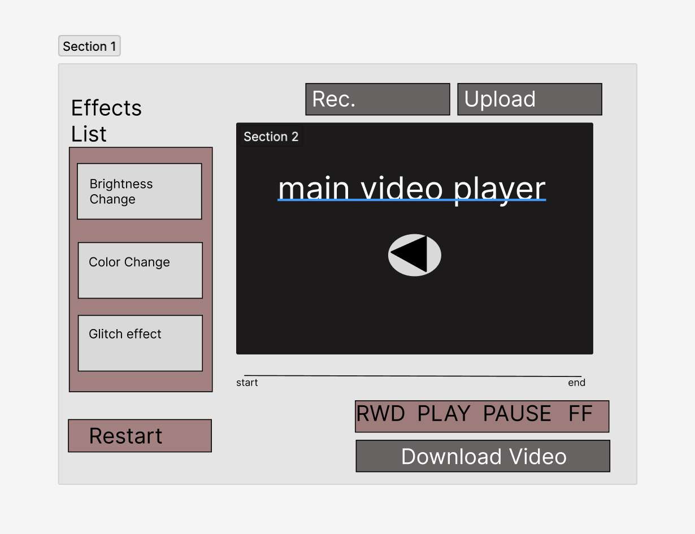

**Background**
 
Welcome to Chromatica, the go-to tool for simple and efficient video editing. Our application offers a range of basic features such as the ability to speed up or slow down your videos, pause and play them, and even adjust the color scheme.

Chromatica's user-friendly interface makes it easy for anyone to make basic edits to their videos with just a few clicks. Whether you want to create a time-lapse or simply change the mood of your video, Chromatica has got you covered.

Our minimalistic approach allows you to focus on the essentials, making video editing accessible to all. Try Chromatica now and give your videos the touch they need.
 
**Functionality & MVPs**
 
- Speed adjustment: Allows users to speed up or slow down their videos.
 
- Playback control: Allows users to pause and play their videos.
 
- Client-side video rendering allows for the user to download videos that they have munipluated 
 
- When a user hovers their mouse over a certain button, the button will change colors signifying that this action could potentially be selected.   

 
In addition, this project will include:
 
- An About modal describing the background of the visualizer
- A production README
 
**Wireframes**
 

 
- Users will have access to a limited amount of effects in which they can impliment them on their video. User would also be able to layer effects on each other.
 
- Users will be able to upload or record a video of their own.
 
- Users will be able to download their mutaed video to their own device.

 Technologies, Libraries, APIs
This project will be implemented with the following technologies:

**Technologies, Libraries, APIs**

This project will be implemented with the following technologies:

- HTML5
- Video.js
- WebRTC
- File API
- Canvas API
- WebSockets
