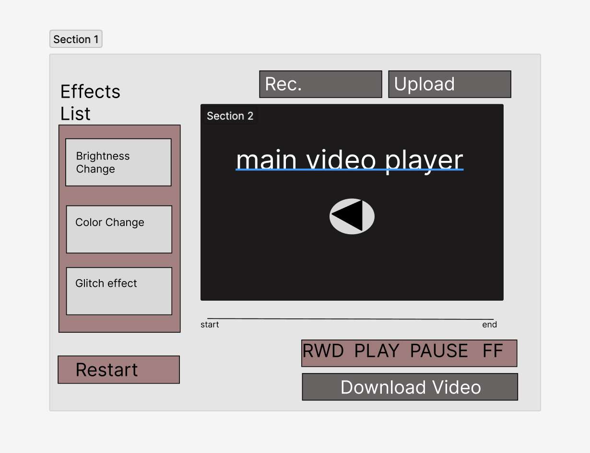

**Chromatica**
https://cornellb02.github.io/Chromatica2/

**Background**
 
Welcome to Chromatica, the go-to tool for simple and efficient video editing. Our application offers a range of basic features such as the ability to speed up or slow down your videos, pause and play them, and even adjust the color scheme.

Chromatica's user-friendly interface makes it easy for anyone to make basic edits to their videos with just a few clicks. Whether you want to create a time-lapse or simply change the mood of your video, Chromatica has got you covered.

Our minimalistic approach allows you to focus on the essentials, making video editing accessible to all. Try Chromatica now and give your videos the touch they need.
 
**Functionality & MVPs**
- Video is playable:  Users can upload a video of their liking, from their device, as the main subject theyll be interacting with. 

- Playback control: Allows users to pause and play their videos.
 
- Hover effects and onclicks: changes the color of a botton when it is hovered over and also when its clicked.   

- Brightness Effect - allows users to adjust the bightness or darkness of the video with a bar. Then allows users to play that video back with this effect on it. 

- Preview screen - before applying your effects to the main video that you would be working with this preview screen allows users to see what they may look like and decide if they would want to change anything. 

Some additional functionalities that will be applied are:

- Speed adjustment: Allows users to speed up or slow down their videos.

- Client-side video rendering allows for the user to download videos that they have munipluated 

- slicing ot splicing - users will be able to minipulate what parts of multiple clips they want to interact with.

- Color change effect - users will be able to add and adjust the color or the entire video. 

- Glitch effect- one very basic effect that causes the screen and colors to do some sort of "glitch" movement.

- Clip container - if a user wanted to upload multiple clips or videos to interact with they will be stored in our clip container.  

- Story line - Storyline is where users can adjust the exact order of how they would want their clips and what effects goes where.
 
In addition, this project will include:
 
- An About modal describing the background of the visualizer

- A production README
 
**Wireframes**
 

 
- Users will have access to a limited amount of effects in which they can impliment them on their video. User would also be able to layer effects on each other.
 
- Users will be able to upload or record a video of their own.
 
- Users will be able to download their mutaed video to their own device.

 Technologies, Libraries, APIs
This project will be implemented with the following technologies:

**Technologies, Libraries, APIs**

This project will be implemented with the following technologies:

- HTML5
- Video.js
- WebRTC
- File API
- Canvas API
- WebSockets
